<style>
    :root{
        --color-background:#fff;
        --font-size: 35px;
    }
    section{
        font-size:22px;
        font-famil: Helvetica, Arial, sans-serif;
    }
    h1{
        font-size:3.0em;
    }
    h2{
        font-size:2.0em;
    }
</style>
<!-- _class: lead -->

# **Python 설치와 빅데이터 분석**

김안정
2024.09.13
포 159 

---
<!-- page number:true-->
## 목표

- 파이썬 프로그램의 구조와 특징을 이해한다.
- 파이썬을 설치하고 작동원리를 이해한다. 
- 주피터 노트북의 개념이 이해하고 구글 Colab으로 노트북 문서를 작성한다.
- 라이브러리 개념을 이해하고 활용한다.
- 파이썬의 변수, 배열, 데이터 프레임의 개념을 이해한다. 
- 파이썬으로 데이터의 기초통계량과 단순회귀분석을 시행하고 시각화를 구현한다.
- 파이썬으로 빅데이터 분석과 머신러닝 등의 작업을 위한 배경 지식을 습득한다. 

</br>

강의자료 및 실습 데이터: https://github.com/AhnjeongKim/ClassPythonforEcon/


---

## Python이란?

웹 애플리케이션, 소프트웨어 개발, 데이터 사이언스와 머신 러닝 등을 위한 도구를 제공하는 프로그래밍 언어
- 프로그래밍 언어 중에서 이해하기 쉬운 편이다.
- 다양한 운영체제에서 작동한다.
- 코드를 한줄씩 실행한다. (인터프리터 방식)
- 데이터 사이언스, 특히 머신 러닝 분야에서 강력한 라이브러리를 제공한다. 

####  라이브러리
코드를 처음부터 작성할 필요가 없도록 파이썬 프로그램에 포함시킬 수 있는 자주 사용되는 코드 모음

##### 데이터 분석과 머신 러닝 관련 라이브러리 

- Numpy - 벡터 및 행렬 연산의 기본이 되는 라이브러리로 array 단위로 데이터를 관리
- Pandas - 데이터 분석용 라이브러리로 데이터 프레임이라는 자료구조로 데이터를 관리
- Matplotlib - 그래프, 이미지 등을 구현하는 데이터 시각화 라이브러리
- Statsmodels - 통계 모델리아 라이브러리
- Keras,TensorFlow,PyTorch,Scikit-learn 등 - 머신 러닝 관련 라이브러리

---
## R vs Python

#### 공통점
* 빅데이터 처리, 머신 러닝 등 데이터 분석을 위한 패키지를 다양하게 제공한다. 
* 둘 모두 데이터 분석가, 데이터 과학자 사이에서 가장 많이 사용되는 프로그래밍 언어로 다양한 패키지와 정보가 제공됨
* 오픈 소스

#### 차이점

|R | Python |
|------|-----|
|- 학술 연구, 통계 분석에 특화 | - 범용 소프트웨어 개발 프로그램|  
|- 수행속도가 상대적으로 느림 | - 수행 속도가 빠름 |
|- 통계, 데이터 분석 및 시각화에 특화 | - 머신러닝, 딥러닝 알고리즘 제공 |

---
## Python 설치 방법 (1) : Python 바로 설치
#### Python 실행 파일을 설치한 후 IDE(통합 개발 환경) 프로그램으로 실행하기

1. Python.org 다운로드 페이지에서 설치 프로그램을 내려받은 후 설치한다.
2.  (Window 환경에서는) 명령 프롬프트나 WindowPowerShell 등을 통해 실행한다.
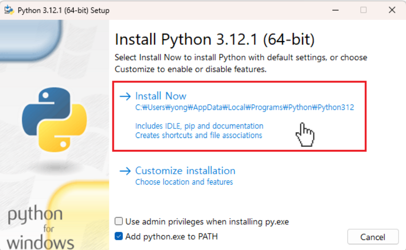 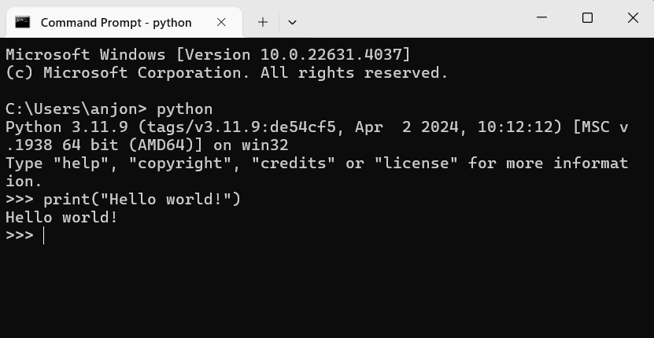

* Mac 환경에서는 터미널을 통해 실행한다. 

---
## Python 설치 방법 (1) : Python 바로 설치
#### Python 실행 파일을 설치한 후 IDE(통합 개발 환경) 프로그램으로 실행하기

3. IDE(통합 개발 환경)을 통해 사용 환경을 구축한다. 
- IDE(통합 개발 환경)란 한 곳에서 코드 작성, 편집, 테스트, 디버깅 등 필요한 도구를 사용자에게 제공하는 별도의 소프트웨어
- Python의 경우 PyCharm, VScode 등을 사용한다.
4. 라이브러리, 패키지 등은 pip를 통해 별도로 설치한다.
* PIP는 Python으로 작성된 패키지 라이브러리를 관리하는 시스템으로 Python 3.4 이후 버전에는 기본적으로 내장되어 있다. 

R studio도 R을 위한 IDE의 한 종류이다. 

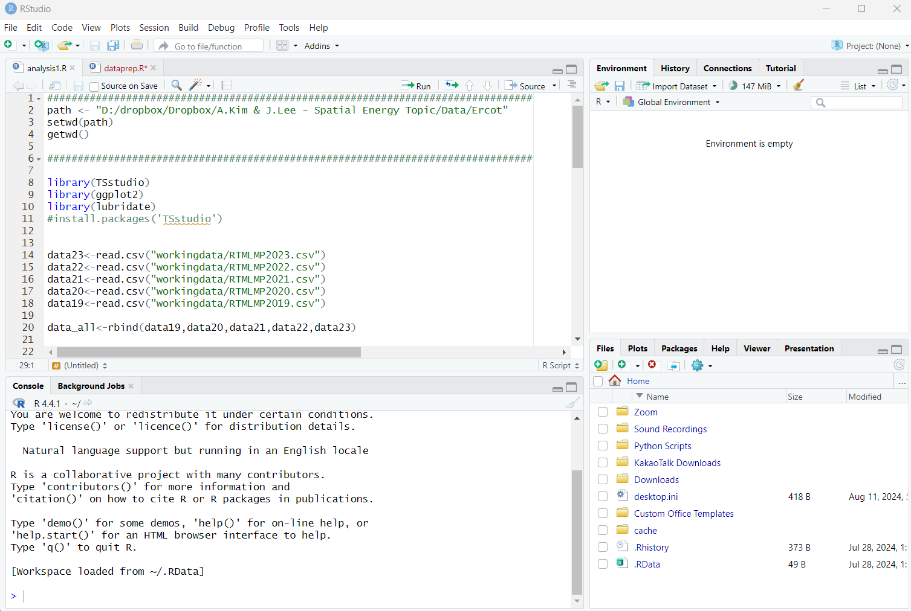

---
## Python 설치 방법 (2) : Anaconda 설치
##### Anaconda란? 
- Python 통합 패키지로 Python을  모듈(Pycharm, Juypter Notebook 등)이 포함된 파이썬 배포판 
- Anaconda 설치 시 머신러닝, 데이터 분석과 관련된 패키지, 라이브러리 등이 함께 설치된다.
- 기본 용량이 크다.
#### 아나콘다 설치하기
1. 공식 홈페이지에서 다운로드 https://www.anaconda.com/download
2. 설치하기
3. Anaconda Prompt(anaconda3)을 실행하여 설치 확인
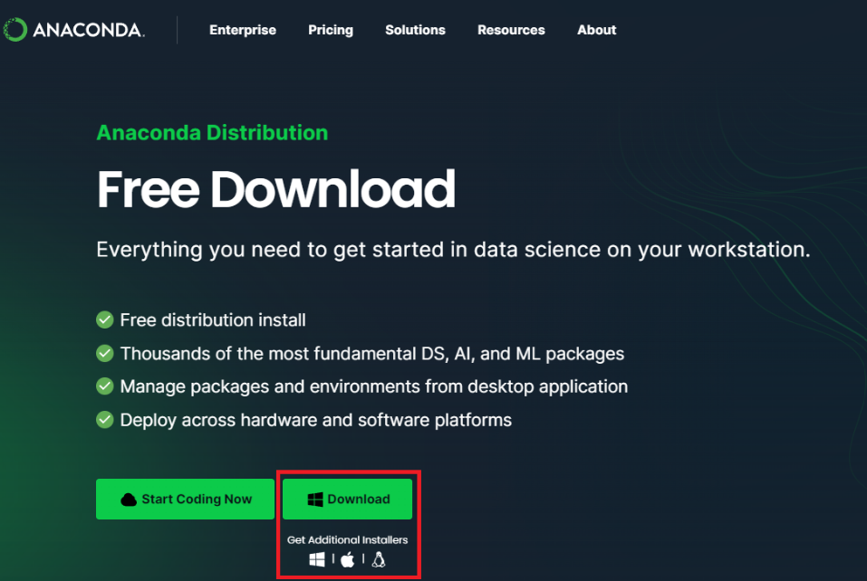 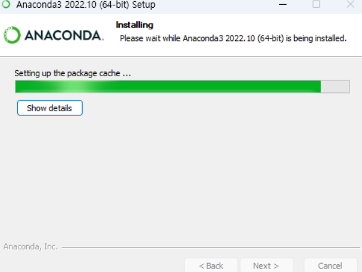 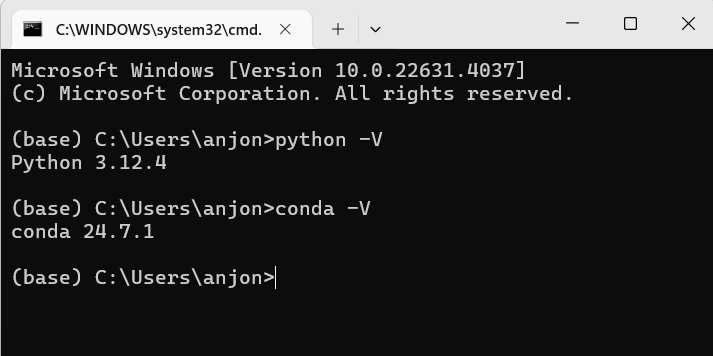
---
## Jupyter Notebook
- 오픈 소스 웹 어플리케이션으로 코드 작성, 시각화 및 문서 작성이 가능한 도구이다.
- 코드를 한줄씩 실행하면서 결과를 확인할 수 있는 대화형 환경을 제공한다. 
- 프로그램을 실행할 수 있는 코드 셀과, 이미지, 텍스트 등을 삽입하는 마크다운 셀로 구성되어 있어 작업을 문서화 할 수 있다.
- 명령 프롬프트를 통해 별도로 설치하거나, Anaconda를 통해 Python과 함께 설치한다.
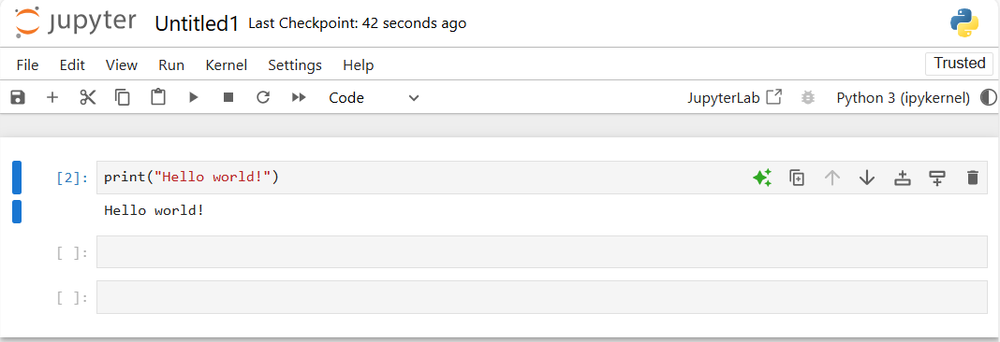
노트북 예시 : https://github.com/donnemartin/data-science-ipython-notebooks/blob/master/scikit-learn/scikit-learn-random-forest.ipynb

---
## Python 설치 방법 (3) : 구글 Colab 
#### Colaboratory: 구글이 제공하는 클라우드 기반 Jupyter notebook 환경
- Python 설치 없이도 웹 브라우저에서 Python 코드를 작성하고 실행할 수 있다. 
- 기본적인 데이터 분석 라이브러리가 내장되어 있다. 
- 구글 클라우드를 기반으로 하여 개인 pc보다 높은 성능과 접근성을 제공하며, 학습용으로 많이 활용된다. 

#### Colab 접속하기
1. 'https://colab.research.google.com/' 에 접속한다.
2. 구글 드라이브에 로그인을 하고 파일 > 새로운 노트북 만들기를 실행한다.

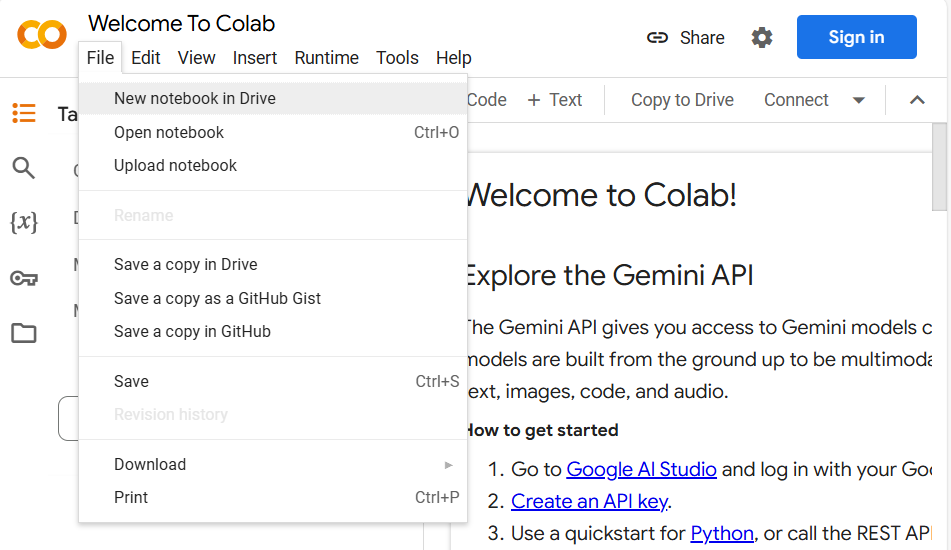  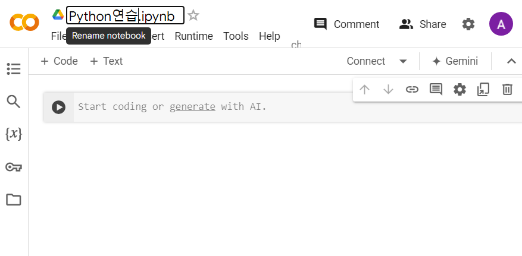

---
## Python 설치 방법 (3) : 구글 Colab 
4. 코드 셀에 실행할 코드를 입력한다. 
```
print("Hello World")
```
5. 실행버튼(▷)을 클릭하고 실행 결과를 확인한다. 
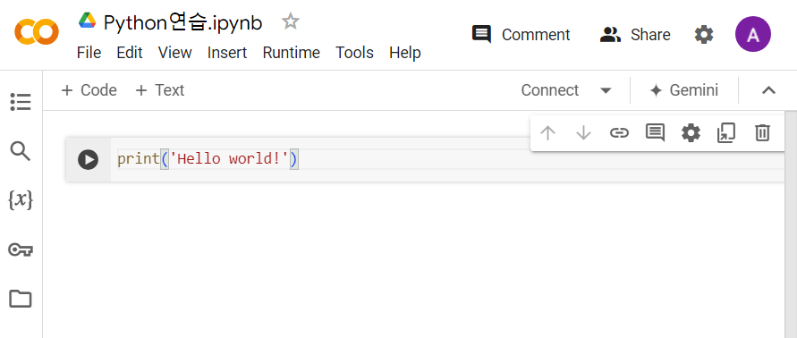 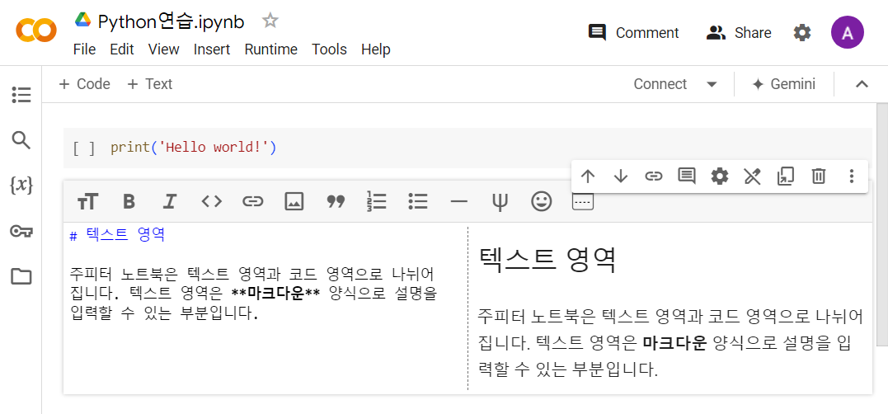

* 마크다운: 텍스트 기반의 마크업 언어로 텍스트만으로 서식있는 문서로, git hub나 notion등에서 양식 있는 게시물들을 작성할 때 자주 사용된다. 

---
## Python 프로그래밍 : 변수 
####  변수란? 
- 프로그래밍에서 값을 저장하는 공간이다. 
- Python에서는 변수의 타입을 미리 정의할 필요가 없다. 
- Python에서 제공하는 변수 타입: **int(정수)**, **float(실수)**, bool(참/거짓), **str(문자열)**, list(순서가 있는 자료의 집합), dict(키와 값의 쌍으로 이루어진 자료의 집합) 등등

#### 숫자 변수
```
a=1
print(a)
```
#### 숫자 변수의 종류와 연산
```
a=1
b=2
c=a
d=a*(b+c)/a-b
print(a,b,c,d)
```
---
## Python 프로그래밍 : 변수 
#### 문자열 변수
- 문자열 변수는 ",'(큰따옴표 혹은 작은 따옴표)로 둘러싸여 있다. 
- Python에서는 문자열을 더하거나 곱할 수 있다. 
```
e="안녕하세요. 파이썬 수업입니다."
print(e)
```
```
d=3.0
print(e+d)
```
#### 문자열 더하기
```
f="3.0"
print(e+f)
```
#### 문자열 곱하기
```
f*2
```

---
## Python 프로그래밍 : 배열

#### 배열Array이란?
* 같은 성질을 갖는 원소들이 순서대로 구성된 선형 자료 구조이다. 
* Index를 통해 데이터를 참조하며, 고정된 크기를 갖는다. (Python의 index는 0부터 시작한다.)
* 1차원, 2차원, 다차원 배열
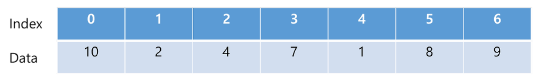

#### 배열 생성하기
```
import numpy as np  
aa=np.array([10,2,4,7,1,8,9])
print(aa)
```
* `import numpy`: numpy 라이프러리를 Python에 추가한다. 
* `as np`: np만 입력해도 사용할 수 있도록 한다. 보편적으로 numpy는 np로 임포트하여 사용한다. 
* `np.array` numpy의 array 함수를 사용한다. 
---
## Python 프로그래밍 : 배열
`ndim`배열의 차원(dimension)을 확인하는 함수
```
print(aa.ndim) 
```
```
bb=np.array([[1,2,3],[4,5,6]])  # 2차원 배열
print(bb.ndim)
```

`shape` 배열의 크기, 각 차원의 길이를 알려주는 함수
```
print("aa's shape:",aa.shape)
print("bb's shape:",bb.shape)
```
`len` 배열의 길이를 알려주는 함수
```
print("aa's length:,len(aa))
bblength=len(bb)
print("aa's length:,bblength)
```
---
## 라이브러리 설치하기 
* Python만 다운로드 받아 설치한 경우에는 라이브러리 설치가 별도로 필요하다. 
* 구글 colab이나 Anaconda를 통해 설치한 경우에는 일반적인 라이브러리에 대해서는 불필요하다.
1. 'cmd' 혹은 'Window PowerShell'을 실행한다. 
2. 설치 명령어를 입력한다. 
```
pip install numpy
pip install pandas
pip install matplotlib
pip install statmodels
```

---
## Python으로 데이터 분석하기

#### Pandas와 데이터 프레임
* 데이터 프레임이란 행과 열이 있는 테이블 형식의 데이터 개체
* Pandas 라이브러리로 수행한다.
* Pandas 패키지는 pd로 임포트하는 것이 관례이다. 
* 엑셀, csv 형식의 파일을 불러오거나, numpy array를 가져올 수도 있다. 

```
import pandas as pd # 판다스 임포트
data = [['AMY', 13, 'girl'],
            ['BEN', 13, 'boy'],
            ['EVA', 14,  'girl'],
            ['KIM', 14,  'girl'],
            ['NEO', 14, 'boy']]

df = pd.DataFrame(data, columns=['Name', 'Age', 'Sex'])
print(bbdf)
```
```
bbdf=pd.DataFrame(bb)
print(bbdf)
```
---
## Python으로 데이터 분석하기
#### 데이터 불러오기
```
df = pd.read_csv('SATandGPA_LinearRegression.csv')
print (df)
```

* 작업 디렉토리 내에 파일이 존재해야 한다. 

* 데이터 출처: https://www.kaggle.com/code/sbk2k1/linear-regression-using-statsmodels/data

#### 불러온 데이터 확인해보기 
```
df.head(10)
```

---
#### 참고1: 작업 디렉토리 확인하기 
```
import os           # 시스템 라이브러리 
os.getcwd()  #디렉토리 경로 확인
```

#### 참고2: 구글 Colab 작업 디렉토리에 파일 업로드하기

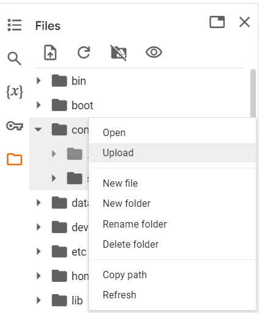
---

---
## Python으로 데이터 분석하기
#### 기초 통계량과 시각화
* `describe()` 함수를 이용한다. 
```
df.describe()
```
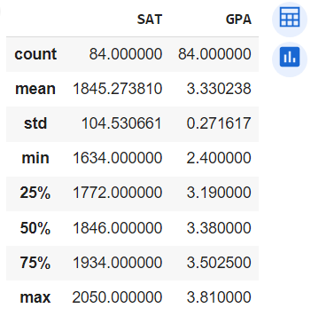

---

* 직접 계산해보기
```
print(df.mean())
print(df.min())
```

---
## Python으로 데이터 분석하기
#### 시각화

```
x=df.loc[:,'SAT']  #df.loc: 데이터 프레임을 라벨을 통해 가져오기 (분석 편의를 위함)
y=df.loc[:,'GPA']  

import matplotlib.pyplot as plt  #matplotlib의 pyplot을 plt라는 이름으로 임포트

plt.scatter(x,y)
plt.show()
```
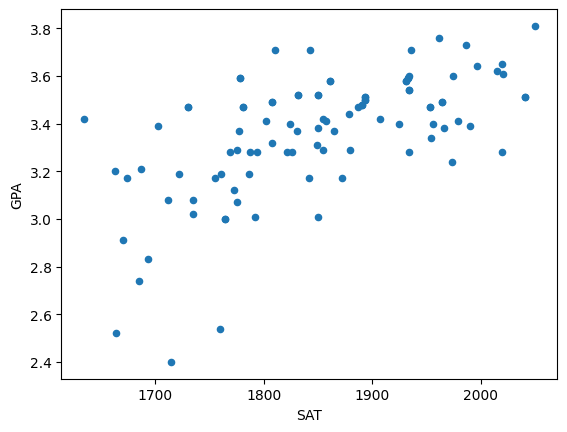

---
## 3. 데이터로 실습해보기 
#### 단순선형회귀 분석
* `statmodels` 패키지에 있는 `ols`함수를 활용한다. 
* `ols('종속변수명 ~ 독립변수명', data=데이터프레임명).fit().summary()`

```
from statsmodels.formula.api import ols  # statsmodel 라이브러리 불러오기

model= ols(formula='SAT~GPA',data=df).fit()
print(model.summary())
```

```
print('parameters',model.params)
print('R2',model.rsquared)
```

---
<!-- _class: lead -->
# Thank you!
anjonghi@gmail.com 